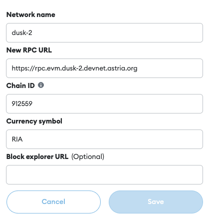

# Astria EVM

## Network Information

| Property | Value |
|-----|-----|
| Network Name | dusk-2 |
| RPC URL | <https://rpc.evm.dusk-2.devnet.astria.org> |
| Chain ID | 912559 |
| Currency Symbol | RIA |
| Dora | <https://www.ondora.xyz/network/astria-devnet> |
| Faucet | <https://faucet.evm.dusk-2.devnet.astria.org> |
| Block Scout | <https://explorer.evm.dusk-2.devnet.astria.org/> |

## Adding to Metamask

Follow Metamask's official documentation to [manually add a custom network.](https://support.metamask.io/hc/en-us/articles/360043227612-How-to-add-a-custom-network-RPC#h_01G63GGJ83DGDRCS2ZWXM37CV5)

Your settings should look like the image below



## Using Cast

Set your `ETH_RPC_URL`:

```bash
export ETH_RPC_URL=https://rpc-archive.evm.dusk-2.devnet.astria.org/
```

```bash
export REC_ADDR=<SOME_ADDRESS>
```

```bash
cast balance $REC_ADDR
```

```bash
cast send $REC_ADDR --value 10000000000000000000 --private-key <PRIVATE-KEY>
```

```bash
cast balance $REC_ADDR
```
