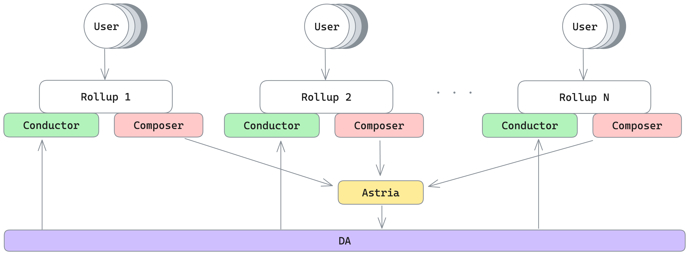

# Run Multiple Rollups Locally

At Astria we believe strongly that deploying a rollup should be as easy as deploying a smart contract. The dev-cluster shows this is indeed possible.

Navigate back to the [dev-cluster](https://github.com/astriaorg/dev-cluster)
repo in your terminal and run the following command with your own rollup name
and network id:

:::warning

**NOTE:** The default rollup name and network id are `astria` and `912559`. When
deploying your second rollup you ___must___ use a different name and number.

:::

```sh
just deploy-rollup <rollup_name> <network_id>
```

As before, it will take a moment for everything to spin up, but in the meantime keep the the rollup name and network id handy and navigate back to your browser and open a new window with the following url, replacing `rollup_name` with the name you just used to deploy your new rollup:

```
http://blockscout.<rollup_name>.localdev.me/
```

Once everything has spin up you will see a new block explorer for your new rollup.

You can now deploy transaction to that rollup independently.
In the `astria-web3/packages/evm-test-data` directory open a new terminal and run the following:

```sh
just generate-transactions <rollup_name> <network_id>
```

As before, this command will deploy test transaction data to your new rollup.
You can also go back to your original terminal window for the test data deployment on the default rollup and rerun the `just generate-transactions` command. If you switch back and forth between the default block explorer window and your new rollup window, you will see transactions showing up on each rollup independently!

To navigate to the new Block Explorer and Faucet from the additional rollup,
take the rollup name that you used and replace `<rollup_name>` in the urls
below:

```
http://blockscout.<rollup_name>.localdev.me/
http://faucet.<rollup_name>.localdev.me/
```

The only limitations to running numerous rollups are the following:
 - Can your hardware handle it
 - There are no rollup name and network id clashes

### What's Going on Under the Hood?

One last thing to mention is what is actually happening when you deploy a new rollup in the dev-cluster. When you you deploy a new rollup the only new containers that are getting spun up in the cluster are a new rollup node, a conductor, block explorer, and faucet. Only one instance of the shared sequencer and the DA layer remain running and the transactions from all the rollups are collectively getting run though those networks.



You can also use `kubectl` to see that this is the case.

When running only the default rollup:

```bash
dev-cluster % kubectl get deployments --all-namespaces
NAMESPACE            NAME                       READY   UP-TO-DATE   AVAILABLE   AGE
astria-dev-cluster   astria-blockscout          1/1     1            1           37s
astria-dev-cluster   astria-faucet              1/1     1            1           37s
astria-dev-cluster   astria-geth                1/1     1            1           37s
astria-dev-cluster   celestia-local             1/1     1            1           94m
astria-dev-cluster   sequencer                  1/1     1            1           94m
ingress-nginx        ingress-nginx-controller   1/1     1            1           94m
kube-system          calico-kube-controllers    1/1     1            1           95m
kube-system          coredns                    2/2     2            2           95m
local-path-storage   local-path-provisioner     1/1     1            1           95m
```

After deploying the second rollup:

```bash
dev-cluster % kubectl get deployments --all-namespaces
NAMESPACE            NAME                       READY   UP-TO-DATE   AVAILABLE   AGE
astria-dev-cluster   anotherrollup-blockscout   1/1     1            1           114s
astria-dev-cluster   anotherrollup-faucet       1/1     1            1           114s
astria-dev-cluster   anotherrollup-geth         1/1     1            1           114s
astria-dev-cluster   astria-blockscout          1/1     1            1           2m13s
astria-dev-cluster   astria-faucet              1/1     1            1           2m13s
astria-dev-cluster   astria-geth                1/1     1            1           2m13s
astria-dev-cluster   celestia-local             1/1     1            1           95m
astria-dev-cluster   sequencer                  1/1     1            1           95m
ingress-nginx        ingress-nginx-controller   1/1     1            1           96m
kube-system          calico-kube-controllers    1/1     1            1           97m
kube-system          coredns                    2/2     2            2           97m
local-path-storage   local-path-provisioner     1/1     1            1           97m
```
