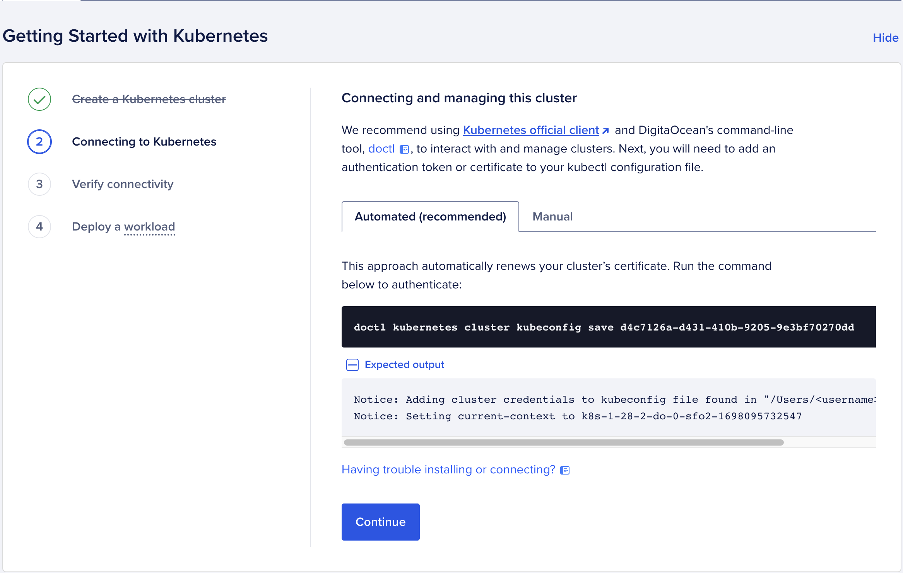
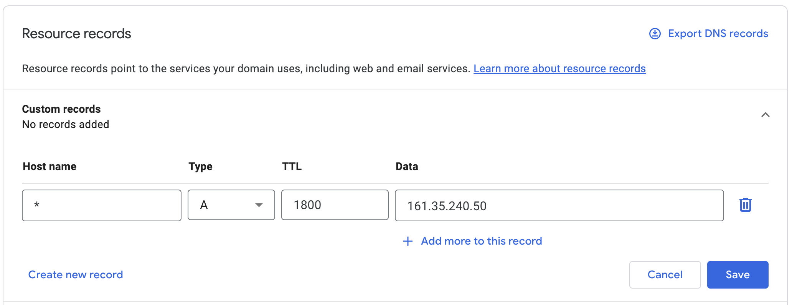

# Digital Ocean

Deploy your rollup to Digital Ocean.

:::info
The list of local dependencies for the following instructions [can be found here](/docs/dusknet/1-overview.md).
:::

The following assumes you are using [Digital Ocean Kubernetes
(DOKS)](https://www.digitalocean.com/products/kubernetes).

We recommend using Digital Ocean's Kubernetes [Quick Start Guide](https://docs.digitalocean.com/products/kubernetes/getting-started/quickstart/).

You must also install and configure `doctl`: https://docs.digitalocean.com/reference/doctl/how-to/install/

## Configure `kubectl` with `doctl`

In your Digital Ocean control panel, navigate to "Connecting to Kubernetes." Run the following command with the `magic-id` 
generated for you.

```bash
doctl kubernetes cluster kubeconfig save <magic-id>
```



## Deploy Ingress Nginx Controller

We use the Ingress NGINX Controller for consistency across deployment environments:

<https://kubernetes.github.io/ingress-nginx/deploy/#digital-ocean>

```bash
kubectl apply -f https://raw.githubusercontent.com/kubernetes/ingress-nginx/controller-v1.8.2/deploy/static/provider/do/deploy.yaml
```

## Verify Loadbalancer with external IP

Look for a new loadbalancer being created in the Digital Ocean console:
https://cloud.digitalocean.com/networking/load_balancers

You can also check that your Digital Ocean load balancer was created using the
following command:

```bash
kubectl get svc -n ingress-nginx
```

You should see something like this:

```bash
NAME                                 TYPE           CLUSTER-IP      EXTERNAL-IP     PORT(S)                      AGE
ingress-nginx-controller             LoadBalancer   10.245.63.28    161.35.240.50   80:32656/TCP,443:30158/TCP   44h
ingress-nginx-controller-admission   ClusterIP      10.245.106.99   <none>          443/TCP                      44h
```

## Create an `A` Record

:::tip
You must configure a DNS record because our ingress configuration uses name
based virtual routing.  
More info here: https://kubernetes.io/docs/concepts/services-networking/ingress/#name-based-virtual-hosting
:::

How you create an `A` record will depend on where you purchased your domain from. Each
domain provider will have different steps required to set up an A record.

An example for Google domains can be seen here: <https://support.google.com/a/answer/2579934?hl=en>

Create a wildcard `*` record pointing to the `EXTERNAL-IP` of your `ingress-nginx-controller`:



## Create your Rollup Genesis Account(s)

:::danger
__NEVER__ use a private key you use on a live network. 
:::

You can add genesis account(s) to your rollup during configuration.

You can create an account using:

```bash
cast w new
```

```bash
Successfully created new keypair.
Address:     0xfFe9...5f8b # <GENESIS_ADDRESS>
Private key: 0x332e...a8fb # <GENESIS_PRIVATE_KEY>
```

Export the genesis private key, this will be used by the faucet included with the rollup:
```bash
export ROLLUP_FAUCET_PRIV_KEY=<GENESIS_PRIVATE_KEY>
```

Export the genesis address alongside with your desired initial balance, in Wei, we recommend using a value of `100000000000000000000` or larger:
```bash
export ROLLUP_GENESIS_ACCOUNTS=<GENESIS_ADDRESS>:<BALANCE>
```

You can specify multiple accounts to be funded at genesis as comma deliminated tuples of `<ADDRESS>:<BALANCE>`

```
export ROLLUP_GENESIS_ACCOUNTS=<ADDRESS_1>:<BALANCE_1>,<ADDRESS_2>:<BALANCE_2>
```

## Install the `astria-cli`

Pull the [Astria repo](https://github.com/astriaorg/astria) and install the `astria-cli`

```bash
git clone git@github.com:astriaorg/astria.git
cd astria
just install-cli
```

## Create Rollup Config

Replace the tags in the commands and env vars below, as follows:

| Var Name | Var Type | Description |
|-----|-----|-----|
| `<YOUR_ROLLUP_NAME>` | String | The name of your rollup. This must be alphanumeric, `-` is allowed, this will be included in URLs|
| `<YOUR_NETWORK_ID>` | u64 | The id of your network. Pick a > 6 digit number (eg. `123456`) |
| `<YOUR_HOSTNAME>` | String | The chosen hostname for your network (eg. `astria.org`) |

You can use environment variables to set the configuration for the rollup
config creation. Replace all the `<>` tags with their corresponding values. 

```bash
export ROLLUP_NAME=<YOUR_ROLLUP_NAME>
export ROLLUP_NETWORK_ID=<YOUR_NETWORK_ID>
export ROLLUP_HOSTNAME=<YOUR_HOSTNAME>
```

Run the config create command:

```sh
astria-cli rollup config create
```

Export the config file name as an env vars:
```bash
export ROLLUP_CONF_FILE=$ROLLUP_NAME-rollup-conf.yaml
```

Verify the config

```sh
cat $ROLLUP_CONF_FILE
```

```sh
namespace: astria-dev-cluster
config:
  useTTY: false
  logLevel: debug
  rollup:
    name: <YOUR_ROLLUP_NAME>
    chainId: <YOUR_ROLLUP_NAME>-chain
    networkId: '<YOUR_NETWORK_ID>'
    skipEmptyBlocks: false
    genesisAccounts:
    - address: <GENESIS_ADDRESS>
      balance: '<BALANCE>'
  sequencer:
    initialBlockHeight: <INITIAL_SEQUENCER_BLOCK_HEIGHT>
    websocket: wss://rpc.sequencer.dusk-2.devnet.astria.org/websocket
    rpc: https://rpc.sequencer.dusk-2.devnet.astria.org
ingress:
  hostname: <YOUR_HOSTNAME>
```

## Create new sequencer account

```bash
astria-cli sequencer account create
```

```bash
Create Sequencer Account

Private Key: "5562...1622" # <SEQUENCER_ACCOUNT_PRIV_KEY>
Public Key:  "ec20...f613" # 
Address:     "8a2f...5f68" # <SEQUENCER_ACCOUNT_ADDRESS>
```

Export your sequencer private key and address as environment variables:

```bash
export SEQUENCER_PRIV_KEY=9c78...710d
export SEQUENCER_ACCOUNT_ADDRESS=8a2f...5f68
```

## Fund your Sequencer Account

Navigate to <https://faucet.sequencer.dusk-2.devnet.astria.org/> to view the sequencer faucet.

Enter your `<SEQUENCER_ACCOUNT_ADDRESS>` into the text box to send funds to your account:


Verify your account received the funds

```bash
astria-cli sequencer balance get $SEQUENCER_ACCOUNT_ADDRESS --sequencer-url=https://rpc.sequencer.dusk-2.devnet.astria.org
```

## Deploy the Rollup Node

Use the `astria-cli` to deploy the node.

```bash
astria-cli rollup deployment create \
  --config $ROLLUP_CONF_FILE \
  --faucet-private-key $ROLLUP_FAUCET_PRIV_KEY \
  --sequencer-private-key $SEQUENCER_PRIV_KEY
```

## Watch for pod startup

```bash
kubectl get pods -n astria-dev-cluster -w
```

```bash
NAME                                             READY   STATUS    RESTARTS      AGE
<YOUR_ROLLUP_NAME>-blockscout-647745c66d-vz4ks   6/6     Running   1 (56s ago)   72s
<YOUR_ROLLUP_NAME>-faucet-68667bd895-pwqmz       1/1     Running   0             72s
<YOUR_ROLLUP_NAME>-geth-755cb8dd97-k5xp8         3/3     Running   0             72s
```

## Observe your Deployment

Your rollups utility endpoints are as follows:

| Utility | URL |
|-----|-----|
| Block Explorer | http://blockscout.<YOUR_ROLLUP_NAME>.<YOUR_HOSTNAME>/ |
| Faucet | http://faucet.<YOUR_ROLLUP_NAME>.<YOUR_HOSTNAME>/ |
| RPC | http://executor.<YOUR_ROLLUP_NAME>.<YOUR_HOSTNAME>/ |

Open the URLs in your browser to view your running rollup.

## Use `cast` to Interact with your Rollup

```bash
export ETH_RPC_URL=http://executor.$ROLLUP_NAME.$ROLLUP_HOSTNAME/
```

```bash
cast block 0
```

Use an address of your choice.

```bash
export REC_ADDR=<SOME_ADDRESS>
```

```bash
cast balance $REC_ADDR
```

```bash
cast send $REC_ADDR --value 10000000000000000000 --private-key $ROLLUP_FAUCET_PRIV_KEY
```

```bash
cast balance $REC_ADDR
```
