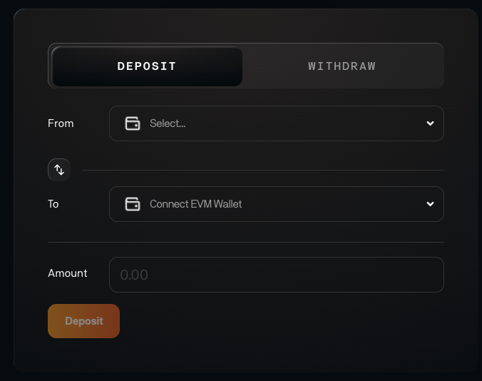

<!-- markdownlint-disable MD041 MD033 -->

# Flame on Mainnet

Flame is the EVM for Celestia Native DeFi. The information below is specifically
for Flame running on the Astria Mainnet.

## EVM Information

| Property | Value |
|-----|-----|
| Network Name | `{{config.flame.mainnet.info.network_name}}` |
| Chain ID | `{{config.flame.mainnet.info.chain_id}}` |
| RPC URL | <a :href="config.mainnet.flame_rpc" target="_blank" rel="noopener noreferrer">{{config.mainnet.flame_rpc}}</a> |
| Flame EVM Block Explorer | <a :href="config.mainnet.flame_explorer" target="_blank" rel="noopener noreferrer">{{config.mainnet.flame_explorer}}</a>  |
| Native sequencer Asset | `{{config.flame.mainnet.info.native_asset}}` |
| Currency Symbol | `{{config.flame.mainnet.info.currency_symbol}}` |

## Adding to Metamask

Follow Metamask's official documentation to [manually add a custom network.](https://support.metamask.io/hc/en-us/articles/360043227612-How-to-add-a-custom-network-RPC#h_01G63GGJ83DGDRCS2ZWXM37CV5)

Your settings should be the following:

| Property | Value |
| --- | --- |
| Network Name | `{{config.flame.mainnet.info.network_name}}` |
| New RPC URL | <a :href="config.mainnet.flame_rpc" target="_blank" rel="noopener noreferrer">{{config.mainnet.flame_rpc}}</a> |
| Chain ID | `{{config.flame.mainnet.info.chain_id}}` |
| Currency symbol | `{{config.flame.mainnet.info.currency_symbol}}` |
| Block Explorer | <a :href="config.mainnet.flame_explorer" target="_blank" rel="noopener noreferrer">{{config.mainnet.flame_explorer}}</a> |

## Bridging

### [Bridge UI](https://bridge.astria.org)

### Celestia (IBC)

| Property | Value |
|-----|-----|
| Supported Asset | `TIA` |
| `celestia` -> `astria` | `{{config.flame.mainnet.bridging.ibc_celestia_to_astria}}` |
| `astria` -> `celestia` | `{{config.flame.mainnet.bridging.ibc_astria_to_celestia}}` |
| Astria Sequencer TIA Bridge Address | `{{config.flame.mainnet.bridging.sequencer_celestia_address}}` |
| Flame TIA Withdrawal Address| `{{config.flame.mainnet.bridging.flame_tia_address}}` |

### Noble (IBC)

| Property | Value |
|-----|-----|
| Supported Asset | `USDC` |
| `noble` -> `astria` | `{{config.flame.mainnet.bridging.ibc_noble_to_astria}}` |
| `astria` -> `noble` | `{{config.flame.mainnet.bridging.ibc_astria_to_noble}}` |
| Astria Sequencer USDC Bridge Address | `{{config.flame.mainnet.bridging.sequencer_noble_address}}` |
| Flame USDC Withdrawal Address| `{{config.flame.mainnet.bridging.flame_usdc_address}}` |

### Osmosis (IBC)

| Property | Value |
|-----|-----|
| Supported Asset | `milkTIA` |
| `osmosis` -> `astria` | `{{config.flame.mainnet.bridging.ibc_osmosis_to_astria}}` |
| `astria` -> `osmosis` | `{{config.flame.mainnet.bridging.ibc_astria_to_osmosis}}` |
| Astria Sequencer USDC Bridge Address | `{{config.flame.mainnet.bridging.sequencer_milktia_address}}` |
| Flame USDC Withdrawal Address| `{{config.flame.mainnet.bridging.flame_milktia_address}}` |

### Stride (IBC)

| Property | Value |
|-----|-----|
| Supported Asset | `stTIA` |
| `stride` -> `astria` | `{{config.flame.mainnet.bridging.ibc_stride_to_astria}}` |
| `astria` -> `stride` | `{{config.flame.mainnet.bridging.ibc_astria_to_stride}}` |
| Astria Sequencer USDC Bridge Address | `{{config.flame.mainnet.bridging.sequencer_sttia_address}}` |
| Flame USDC Withdrawal Address| `{{config.flame.mainnet.bridging.flame_sttia_address}}` |

## Uniswap V3

| Name | Address |
|---|---|
| Descriptor Proxy Address | `{{config.mainnet.descriptorProxyAddress}}` |
| Multicall 2 Address | `{{config.mainnet.multicall2Address}}` |
| nft Position Descriptor Address | `{{config.mainnet.nftPositionDescriptorAddress}}` |
| nft Position Manager Address | `{{config.mainnet.nftPositionManagerAddress}}` |
| Proxy Admin Address | `{{config.mainnet.proxyAdminAddress}}` |
| Quoter V2 Address | `{{config.mainnet.quoterV2Address}}` |
| Swap Router 02 Address | `{{config.mainnet.swapRouter02Address}}` |
| Tick Lens Address | `{{config.mainnet.tickLensAddress}}` |
| v3 Core Factory Address | `{{config.mainnet.v3CoreFactoryAddress}}` |
| v3 Migrator Address | `{{config.mainnet.v3MigratorAddress}}` |
| v3 Staker Address | `{{config.mainnet.v3StakerAddress}}` |
| wTIA9 Address | `{{config.mainnet.weth9Address}}` |
