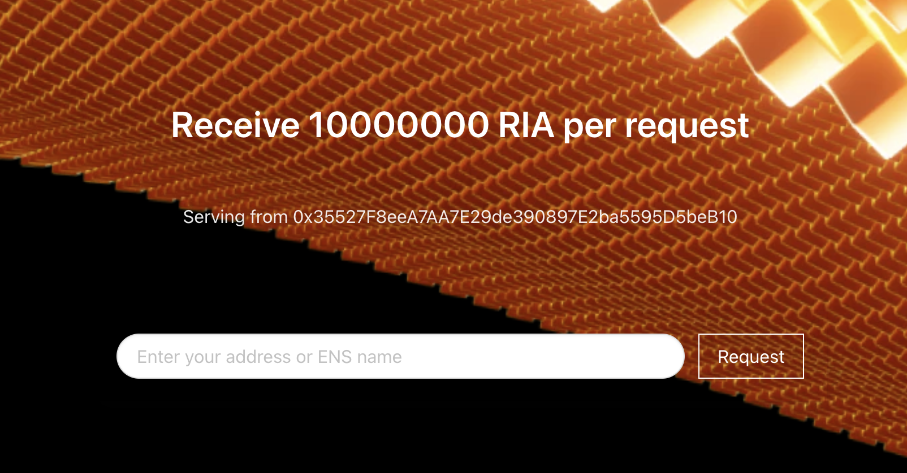

# Overview

This guide will walk you through deploying a rollup full node on
a local Kubernetes cluster which uses the Astria shared sequencer network.

## Local Dependencies

:::info
This guide has been tested on MacOS and Linux but not Windows
:::

### Clone the Astria [dev-cluster](https://github.com/astriaorg/dev-cluster/tree/main)

```bash
git clone --branch dusk-2 https://github.com/astriaorg/dev-cluster.git
```

### Install the latest [astria cli](https://github.com/astriaorg/astria/releases/tag/cli-v0.2.0)

import Tabs from '@theme/Tabs';
import TabItem from '@theme/TabItem';

<Tabs>
  <TabItem value="ARM Mac" label="ARM Mac" default>

    curl -L https://github.com/astriaorg/astria/releases/download/cli-v0.2.0/astria-cli-aarch64-apple-darwin.tar.gz > astria-cli.tar.gz
    tar -xvzf astria-cli.tar.gz 

  </TabItem>
  <TabItem value="X86_64 Mac" label="X86_64 Mac">

    curl -L https://github.com/astriaorg/astria/releases/download/cli-v0.2.0/astria-cli-x86_64-apple-darwin.tar.gz > astria-cli.tar.gz
    tar -xvzf astria-cli.tar.gz 

  </TabItem>
  <TabItem value="x86_64 Linux" label="x86_64 Linux">

    curl -L https://github.com/astriaorg/astria/releases/download/cli-v0.2.0/astria-cli-x86_64-unknown-linux-gnu.tar.gz > astria-cli.tar.gz
    tar -xvzf astria-cli.tar.gz 

  </TabItem>
   <TabItem value="From Source" label="From Source">

    cargo install astria-cli --git=https://github.com/astriaorg/astria --tag=cli-v0.2.0 --locked

  </TabItem>
</Tabs>

You'll also need to install the following tools:

:::warning
There is a bug in the latest Docker desktop release for MacOS  
Please install the following release:
<https://docs.docker.com/desktop/release-notes/#4252>  
For more details see [here](https://github.com/docker/for-mac/issues/7100)
:::

- docker - <https://docs.docker.com/get-docker/>
- kubectl - <https://kubernetes.io/docs/tasks/tools/>
- helm - <https://helm.sh/docs/intro/install/>
- kind - <https://kind.sigs.k8s.io/docs/user/quick-start/#installation>
- just - <https://just.systems/man/en/chapter_4.html>
- Foundry Cast and Forge tools - <https://book.getfoundry.sh/getting-started/installation>

## Dusknet Endpoints

The endpoints for the remote shared sequencer are:

| NAME | HOSTS | ADDRESS |
|-----|-----|-----|
| Sequencer RPC | rpc.sequencer.dusk-2.devnet.astria.org | 34.111.73.187 |
| Sequencer Faucet | faucet.sequencer.dusk-2.devnet.astria.org | 34.36.8.102 |

## Setup Local Environment

We use the [Astria
dev-cluster](https://github.com/astriaorg/dev-cluster) to setup a local
Kubernetes (k8s) cluster where we will deploy our local rollup.

:::tip
Make sure that Docker is running before continuing.
:::

In the __dev-cluster__ repo, run:

```sh
just create-cluster
just deploy-ingress-controller
```

This sets up a local environment compatible with our helm charts.

## Create your Rollup Genesis Account(s)

:::danger
__NEVER__ use a private key you use on a live network.
:::

Specify the accounts which will be funded at the genesis block of your EVM rollup.

You can create an account using:

```bash
cast w new
```

```bash
Successfully created new keypair.
Address:     0xfFe9...5f8b # <GENESIS_ADDRESS>
Private key: 0x332e...a8fb # <GENESIS_PRIVATE_KEY>
```

Export the genesis private key, this will be used by the
 faucet included with the rollup:

```bash
export ROLLUP_FAUCET_PRIV_KEY=<GENESIS_PRIVATE_KEY>
```

Export the genesis address alongside with your desired initial balance in Wei.  
We recommend using a value of `100000000000000000000` or larger:

```bash
export ROLLUP_GENESIS_ACCOUNTS=<GENESIS_ADDRESS>:<BALANCE>
```

You can specify multiple accounts to be funded at
 genesis as comma deliminated tuples of `<ADDRESS>:<BALANCE>`

```bash
export ROLLUP_GENESIS_ACCOUNTS=<ADDRESS_1>:<BALANCE_1>,<ADDRESS_2>:<BALANCE_2>
```

## Create Rollup Config

Create the configuration manifest for your rollup.

Replace the tags in the commands and env vars below, as follows:

| Var Name | Var Type | Description |
|-----|-----|-----|
| `<YOUR_ROLLUP_NAME>` | String | The name of your rollup. This must be lowercase alphanumeric, `-` is allowed, this will be included in your rollup's URLs.|
| `<YOUR_NETWORK_ID>` | u64 | The id of your network. You must select an id that has not already been claimed. You can view claimed chain IDs [here](https://chainlist.org/).|

You can use environment variables to set the configuration for the rollup
config creation. Replace all the `<>` tags with their corresponding values.

```bash
export ROLLUP_NAME=<YOUR_ROLLUP_NAME>
export ROLLUP_NETWORK_ID=<YOUR_NETWORK_ID>
```

Run the config create command:

```sh
astria-cli rollup config create
```

Export the config file name as an env vars:

```bash
export ROLLUP_CONF_FILE=$ROLLUP_NAME-rollup-conf.yaml
```

Verify the config

```bash
cat $ROLLUP_CONF_FILE
```

```bash
global:
  namespace: astria-dev-cluster
  useTTY: false
  logLevel: debug
config:
  rollup:
    name: <YOUR_ROLLUP_NAME>
    chainId: <YOUR_ROLLUP_NAME>-chain
    networkId: '<YOUR_NETWORK_ID>'
    genesisAccounts:
    - address: <GENESIS_ADDRESS>
      balance: '<BALANCE>'
  sequencer:
    initialBlockHeight: <INITIAL_SEQUENCER_BLOCK_HEIGHT>
    websocket: wss://rpc.sequencer.dusk-2.devnet.astria.org/websocket
    rpc: https://rpc.sequencer.dusk-2.devnet.astria.org
ingress:
  hostname: localdev.me
celestia-node:
  config:
    labelPrefix: <YOUR_ROLLUP_NAME>
```

## Create a New Sequencer Account

Create an account on the Astria shared sequencer network
 for your rollup to submit transactions.

```bash
astria-cli sequencer account create
```

```bash
Create Sequencer Account

Private Key: "5562...1622" # <SEQUENCER_ACCOUNT_PRIV_KEY>
Public Key:  "ec20...f613" # 
Address:     "8a2f...5f68" # <SEQUENCER_ACCOUNT_ADDRESS>
```

Export your sequencer private key and address as environment variables:

```bash
export SEQUENCER_PRIV_KEY=5562...1622
export SEQUENCER_ACCOUNT_ADDRESS=8a2f...5f68
```

## Fund your Sequencer Account

Navigate to <https://faucet.sequencer.dusk-2.devnet.astria.org/> to view the
 sequencer faucet.

Enter your `<SEQUENCER_ACCOUNT_ADDRESS>` into the text box to send
 funds to your account:



Verify your account received the funds

```bash
astria-cli sequencer account balance $SEQUENCER_ACCOUNT_ADDRESS
```

## Deploy the Rollup Node

Use the `astria-cli` to deploy the rollup node

```bash
astria-cli rollup deployment create \
  --config $ROLLUP_CONF_FILE \
  --faucet-private-key $ROLLUP_FAUCET_PRIV_KEY \
  --sequencer-private-key $SEQUENCER_PRIV_KEY
```

## Watch for rollup startup

You can watch for the Kubernetes pods of the rollup to start with:

```bash
kubectl get pods -n astria-dev-cluster -w
```

```bash
NAME                                             READY   STATUS    RESTARTS      AGE
<YOUR_ROLLUP_NAME>-blockscout-647745c66d-vz4ks     6/6     Running   1 (56s ago)   72s
<YOUR_ROLLUP_NAME>-celestia-node-light-mocha-4-0   2/2     Running   1 (56s ago)   72s
<YOUR_ROLLUP_NAME>-faucet-68667bd895-pwqmz         1/1     Running   0             72s
<YOUR_ROLLUP_NAME>-geth-755cb8dd97-k5xp8           3/3     Running   0             72s
```

## Your Rollup Endpoints

Your rollup will automatically be configured
with the several locally accessible endpoints:

| Utility | URL |
|-----|-----|
| Block Explorer | `http://blockscout.<YOUR_ROLLUP_NAME>.localdev.me/` |
| Faucet | `http://faucet.<YOUR_ROLLUP_NAME>.localdev.me/` |
| RPC | `http://executor.<YOUR_ROLLUP_NAME>.localdev.me/` |

## Interact with your Rollup

```bash
export ETH_RPC_URL=http://executor.$ROLLUP_NAME.localdev.me/
```

```bash
cast block 0
```

Use an address of your choice.

```bash
export REC_ADDR=<SOME_ADDRESS>
```

```bash
cast balance $REC_ADDR
```

```bash
cast send $REC_ADDR --value 10000000000000000000 --private-key $ROLLUP_FAUCET_PRIV_KEY
```

```bash
cast balance $REC_ADDR
```
