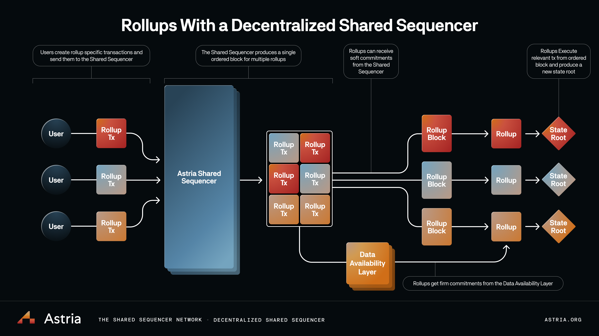

# Decentralized by Default

Centralization is antithetical to crypto. And yet, today’s rollups almost universally depend on a single sequencer. Centralized sequencers provide fast transaction confirmations and reduce costs by batching and compressing transactions. However, these benefits come at the cost of relying on a single trusted actor for liveness and censorship resistance.

**Sacrificing decentralization for an improved user experience is an unacceptable Faustian bargain.**

Astria tackles centralization head-on, providing rollups with a decentralized sequencer and even better UX. Astria’s shared sequencer network is a middleware blockchain with its own decentralized sequencer set which accepts transactions from multiple rollups. These transactions are ordered into a single block and written to the base layer without executing them.

Rollups can retrieve blocks from Astria immediately after they’re created, without waiting for the base layer to include them. The economic weight of Astria’s decentralized sequencer set provides confidence that this transaction order is final. This “soft commitment” allows rollups to provide their end users with fast block confirmations. Alternatively, rollups can wait for blocks to be included by the base layer, giving them the strongest finality. All transactions still get this “firm commitment” at the speed of the base layer, fast pre-confirmations are just an additional feature that Astria provides to rollups if they choose to use it.

To generate a new state root, a rollup’s full nodes retrieve a block from either
Astria or the base layer, check it against Astria’s fork choice rule, filter out
transactions from other rollups, and apply the resultant subset of transactions
to their previous state. Headers can then be generated from this state root and
gossiped to light clients. Rollups of this style are termed ‘Lazy Rollups’, a
nod to the [Lazy
Evaluation](https://en.wikipedia.org/wiki/Lazy_evaluation?ref=blog.astria.org)
principle found in programming language theory.
