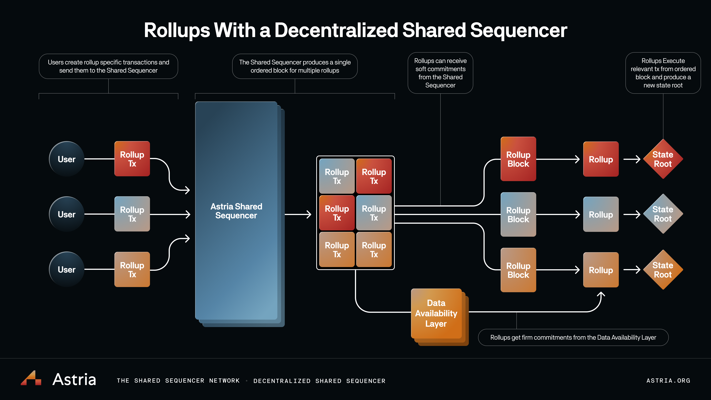

# Why Decentralized Sequencers?

:::tip
To deploy your own rollup on the Astria Dusknet devnet, check out the
[instructions here](/docs/dusknet/overview/)!
:::

Centralization is antithetical to crypto. And yet, today’s rollups almost
universally depend on a single sequencer. Centralized sequencers provide fast
transaction confirmations and reduce costs by batching and compressing
transactions. However, these benefits come at the cost of relying on a single
trusted actor for liveness and censorship resistance.

**Sacrificing decentralization for an improved user experience is an
unacceptable Faustian bargain.**

Astria tackles centralization head-on, providing rollups with a decentralized
sequencer and even better UX. Astria’s shared sequencer network is a middleware
blockchain with its own decentralized sequencer set which accepts transactions
from multiple rollups. These transactions are ordered into a single block and
written to the base layer without executing them.

