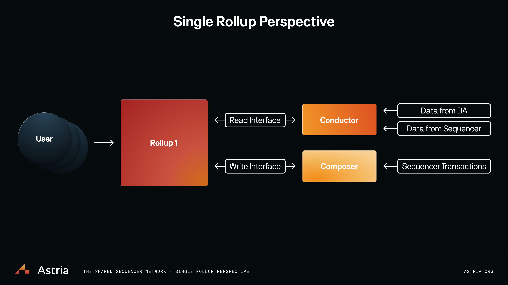

# Rollups

<!--@include: ./../../components/_deployment-instructions-redirect.md-->

<DeploymentsRedirect />

Astria is designed for permissionless rollup integration and takes advantage of [lazy](https://en.wikipedia.org/wiki/Lazy_evaluation?ref=blog.astria.org) shared sequencing. This means that rollup developers have total sovereignty over their own execution state and can swap out sequencing layers without fear of being locked in. You do not need to ask for permission or go through a governance process to gain access. A rollup simply needs to satisfy the following interfaces:

Write Interface (Rollup to Composer):
- For transaction submissions.

Read Interface (Rollup to Conductor):
- For receiving blocks from the shared sequencer network.

The Composer and Conductor are explained in more detail in future sections.

Both composer and conductor expose [gRPC](https://grpc.io/) interfaces. See the [astria-protos](https://github.com/astriaorg/astria/tree/main/crates/astria-proto) repo for specific implementation details.

Astria currently deploys a fork of
[Geth](https://github.com/astriaorg/go-ethereum) as an EVM rollup.
