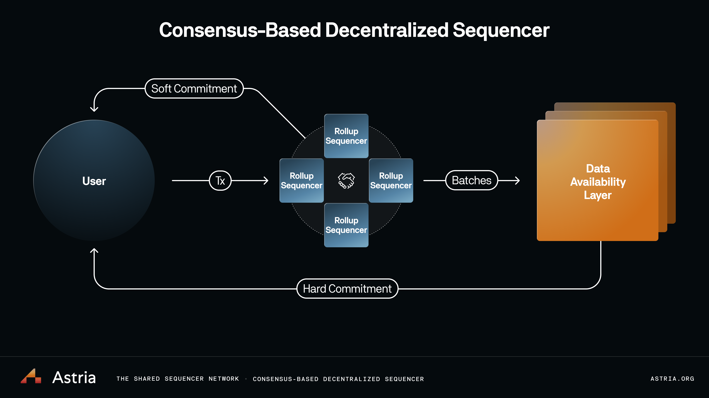

# The Astria Sequencer

:::tip
To deploy your own rollup on the Astria Dusknet, check out the
[instructions here](/docs/local-rollup/introduction/)!
:::

The Astria Shared Sequencer is a decentralized network of nodes utilizing CometBFT that come to consensus on an ordered set of transactions (ie. it is a blockchain). The unique feature of the sequencer is that the transactions it includes are not executed (lazy sequencing), and are destined for another execution engine (ie. a rollup). This excludes “sequencer native” transactions, such as transfers of tokens within the sequencer chain. Transactions from any given rollup are only ordered on the sequencer, not executed.

The sequencer can optionally act as a “validator”, meaning it actively
participates in the production and finalization of new blocks.

Components of note that are not shown in the above diagram are the [Composer](/docs/overview/architecture/4-composer.md),
[Relayer](/docs/overview/architecture/6-relayer.md), and [Conductor](/docs/overview/architecture/7-conductor.md). 

These components facilitate the delivery of transactions,
batches, and different commits shown above, back to the users.

See the [Sequencer code here.](https://github.com/astriaorg/astria/tree/main/crates/astria-sequencer)
