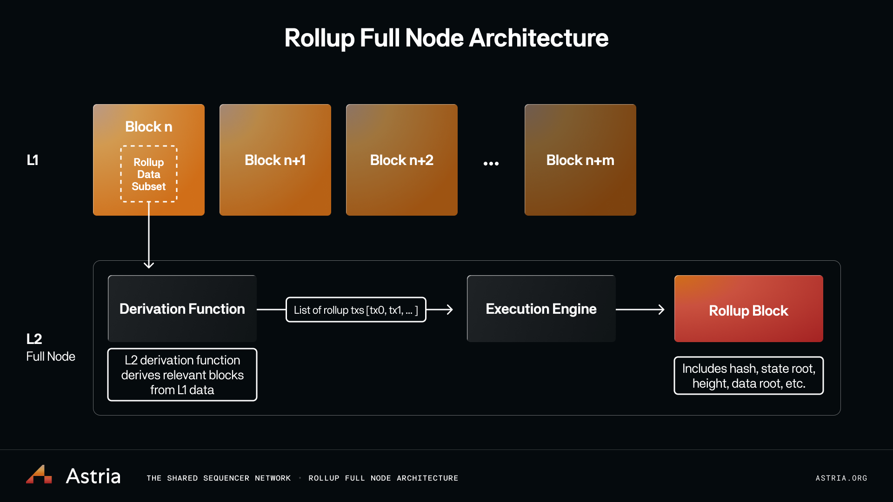
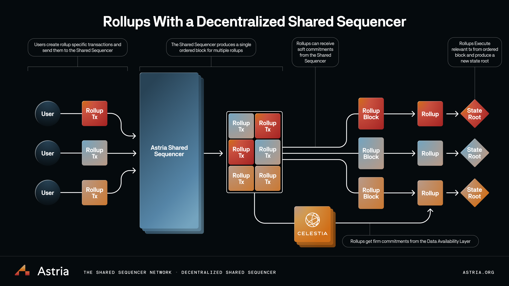

# How Rollups Work

A rollup is a blockchain that consists of a state transition function executed
over some subset of data contained in another blockchain, the L1. Bridging
to/from the L1 (by enshrining the rollup’s state transition in the L1) is
implemented by non-sovereign rollups.

## Rollup Full Node Architecture

A rollup needs to perform the following:

* read relevant subsets of data from the L1
* turn this data into rollup transactions
* execute these transactions to form a rollup block

The first two points are part of “rollup consensus” while the last is “rollup
execution”.

The main component required for rollup consensus is an L1 derivation function,
which derives the transactions for a rollup block deterministically from the
data on the L1. This data generally looks like calldata or blob data posted to
the chain and/or events emitted from a contract. This data is extracted and
turned into rollup transactions.

After the set of rollup transactions for a block has been derived, they are
passed to the rollup execution layer, which executes the transactions and
updates the rollup state. After execution, a new rollup state root is created.

Unlike L1 nodes, rollup nodes do not necessarily need to form a p2p network and
communicate with each other for consensus. The chain’s consensus is provided by
the L1, and all (properly-functioning) rollup nodes will deterministically
derive the same state given the same L1 state.

However, rollup nodes may still wish to form a p2p network for two reasons: fast
confirmations, which can be received from the sequencer, or for rollup light
nodes.

## Rollup Sequencers

In the above section, we discussed how a rollup derives its transactions, but
how does the rollup data end up on L1?

A simple solution is to have users post their rollup transactions to the L1
directly. However, this is not ideal because there is not as much of an economic
benefit (users have to pay for L1 inclusion, plus L2 execution) for them to do
so. As well, users need to wait for L1 blocks to know if their transaction was
included.

A more cost- and time-effective solution is to use a sequencer. Rollup
sequencers are akin to block producers on L1. They have the privilege of
determining ordering and inclusion for rollup blocks. The sequencer collects a
set of rollup transactions, batches them, optionally compresses them, and posts
them to L1. Compression has the benefit of reducing the L1 inclusion cost for
each rollup transaction. Sequencers also provide “pre-confirmations” or “fast
confirmations”, meaning the sequencer can provide a commitment to the user that
their transaction will end up in a specific rollup block before the
corresponding L1 block has actually been published.

Sequencers to date have been implemented as a centralized service, generally run
by rollup teams themselves. This means there is one party responsible for rollup
transaction ordering and inclusion, leading to a monopoly on MEV extraction and
the potential for transaction censorship. While there is always the “escape
hatch” by which users post their rollup transactions directly to the L1 for
inclusion on the rollup, this is a poor UX alternative.

## Decentralized Sequencers

A decentralized sequencer network is an alternative to the centralized service,
where multiple sequencer nodes each have the ability to propose a batch of
rollup transactions.

The flow would then look like:

* a proposer proposes some transaction batch, or commitment to some transaction
  batch the network reaches consensus over this batch
* the transaction batch data is made available to rollup nodes

A simple solution is to have a permissioned set, where only batches signed by a
key from the chosen set are allowed to be derived into rollup blocks. To make
this permissionless, we need to allow anyone to join the sequencer node set -
eg. through proof-of-stake. By putting up some stake, anyone can join the
sequencer network as a consensus node, and have the privilege of proposing
transaction batches.

There are a few options regarding the asset(s) used as stake on the sequencer
network. The first is to create a native asset on the sequencer network to be
used for staking, as well as for transaction fees. The second is to use the
asset of an underlying data availability layer for staking and transaction fees.

## Sequencing Layer

Currently, sequencers are implemented for one specific rollup. Instead of this,
we can have a sequencer batch transactions for many rollups. With data
compression, this allows for greater cost savings when posting data to L1. A
sequencer network that is decentralized and shared incentivizes actors from
multiple rollup ecosystems to potentially act as validators on the sequencer
network.

Current sequencer implementations generally execute the transactions that it
sequences as well. By allowing the sequencer to sequence many rollups, it can
either execute the transactions for each rollup it sequences for, or have it not
execute any transactions at all, and remain ignorant of the rollup state
machines it’s sequencing for (known as lazy sequencing).

The downside to executing the transactions for each rollup is that it’s much
more difficult to add new rollups to the sequencing layer, as the sequencer
needs to be forked and made aware of a new state machine. Additionally, as the
state of the rollups grows, the sequencer execution time gets slower and slower
(the same way state bloat affects L1s), but it’s potentially even worse over
time since many states are involved.

The better solution is the second, where the sequencing layer’s function is
reduced to only sequencing and not executing. In this model, the sequencing
layer batches and orders generic transaction data, where the data is tagged
with the rollup it’s destined for, and only after the sequencer commits to the
batch is the data executed by rollup nodes.

## Rollup light nodes

Rollup light nodes, like normal L1 light nodes, follow the consensus of the main
chain and verify and sync its headers, without executing the full transaction
data of the chain. A rollup light node needs to do a few more things to verify
headers than an L1 light node.

A rollup light node needs to:

* implement an L1 consensus light client
* implement an L2 consensus light client
* ensure that the transaction data for each L2 block was published

A light node of a rollup that uses a sequencing layer needs to verify the
consensus of the sequencer chain, as the sequencer acts as the equivalent of the
L1 - i.e. it’s where transaction inclusion and ordering is finalized. It needs
to follow the headers and verify consensus of the sequencer chain. Since light
nodes don’t store the blockchain state, to verify if a rollup transaction was
included in some rollup block X, the light node first needs a Merkle proof that
the rollup transaction was included in the transactions/data root of some
sequencer chain header. Then, if it follows that rollup block X was derived from
sequencer block Y (using the rollup derivation function), it knows that the
transaction should be included in rollup block X. The light node also needs to
check that the block data was published, which it can do via data availability
sampling (for example, when using Celestia).
