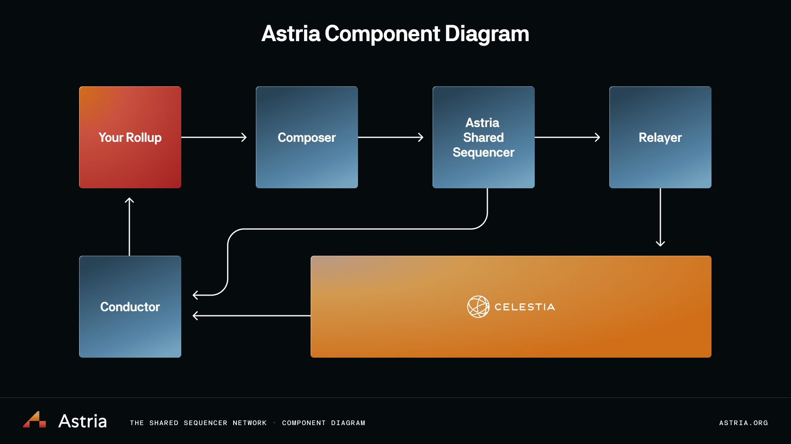

# Introduction

Astria is building a decentralized sequencing layer that can be shared amongst multiple rollups.

At a high level, the Astria stack performs the following functions:

* sequences arbitrary data for usage by multiple rollups
* makes this data available to rollup nodes
* allows rollup nodes to easily fetch and verify sequenced data
* batches rollup blocks and posts these batches to Celestia

The first two are mandatory, while the last is implemented more for the
developer experience, allowing rollup developers to focus only on the
rollup-specific application logic, as opposed to the other aspects such as
rollup consensus.

The first requirement (sequencing of arbitrary data for rollups) is implemented
by the Astria sequencer network, a PoS network of sequencer nodes that use
CometBFT for consensus. The sequencer network comes to consensus on the ordering
and inclusion of rollup transactions of the form (rollup_id, tx_bytes). The
rollup_id can be any arbitrary string; it’s used only by rollup nodes to
determine which data is for them. The second (making data available to rollup
nodes) is achieved by publishing the sequenced data via Celestia.

The third (allowing rollup nodes to easily fetch and verify sequenced data) is
achieved by the Astria “Conductor”, which works similarly to existing rollup
“consensus nodes”, such as op-node within the OP Stack. The conductor obtains
the sequenced data, verifies it, and derives the transactions for a specific
rollup, all while remaining agnostic to the transaction format and state
transition function of the rollup execution node. It then passes the derived
transactions to the rollup execution node for processing.

The Astria sequencer network is a lazy sequencer. This means that data is
sequenced and committed, but execution is delayed until necessary, and is left
to the rollup. This de-couples the execution logic from the consensus logic,
removing consensus bottlenecks and allowing for more flexibility for rollup
developers. For example, since the data is executed lazily, a rollup may choose
to have 2 rollup blocks per Astria block, or 1 rollup block per Astria block.
The rollup’s consensus and execution logic is not enshrined in the sequencer.

## What Should I Read?

Want to learn more about about rollups or the sequencer? Check out the [How
Rollups Work](/overview/how-rollups-work) or [The Astria Sequencer
Network](/overview/the-astria-sequencer-network).

If you're a rollup developer eager to get started, you should go straight to our
[`astria-go` cli tutorials](../developer/tutorials/dev-cluster-local-rollup).

For more advanced development, you can read about deploying a rollup full using
a local Kubernetes cluster [here](../local-rollup/1-introduction.md).

You can find our endpoints and FAQ [here](/astria-evm/overview.md)

## Still Need More Help

While this documentation hopefully includes everything you need, if you can't
find what you're looking for, please reach out on Discord [Discord](https://discord.gg/3qZCbmZxvF) or check the [Astria
repository](https://github.com/astriaorg/astria).
