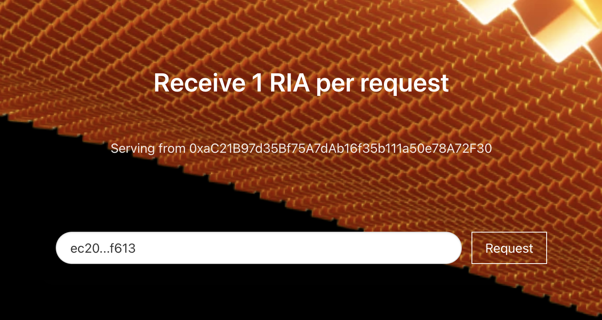

# Local Rollup Deployment

## Deploy the Local Run Environment

In another directory, use the [Astria
dev-cluster](https://github.com/astriaorg/dev-cluster), deploy 
the local environment where your rollup will run.
Although we are using the dev-cluster here again, this is different from
[running the full local setup discussed
previously](../dev-cluster/2-run-dev-cluster-locally.md). In this instance, we
are using the dev-cluster to setup the local environment in which the rollup,
block explorer, and faucet will run (like before), but we will not be running
the sequencer or any of the other components.

:::tip
Make sure that Docker is running before deploying with `just`.
:::

In the __dev-cluster repo__, run:

```sh
git clone git@github.com:astriaorg/dev-cluster.git
cd dev-cluster
just create-cluster
just deploy-ingress-controller
just wait-for-ingress-controller
```

This creates the local environment where the rollup will run. Unlike when the
full dev-cluster is run locally, the sequencer and DA are not spun up. The
dev-net is already running remotely.

## Create a New Sequencer Account

Back in the __Astria repo__, run the cli to create the address and key
information for a new sequencer account. 

```bash
./target/release/astria-cli sequencer account create
```

The address, public and private keys will be different from those below. Save
these values for later use.

```bash
Create Sequencer Account

Private Key: "5562...1622" # <SEQUENCER_ACCOUNT_PRIV_KEY>
Public Key:  "ec20...f613" # <SEQUENCER_ACCOUNT_PUB_KEY>
Address:     "8a2f...5f68"
```

Keep track of the `<SEQUENCER_ACCOUNT_PUB_KEY>` as it will be used with the
Faucet later on for funding your sequencer account.

Now export the private key printed above:
```bash
export SEQUENCER_PRIV_KEY=<SEQUENCER_ACCOUNT_PRIV_KEY>
```

## Deploy the Configuration

Then deploy the configuration with:

```bash
./target/release/astria-cli rollup deployment create \
  --config $ROLLUP_CONF_FILE \
  --faucet-private-key $ROLLUP_FAUCET_PRIV_KEY \
  --sequencer-private-key $SEQUENCER_PRIV_KEY
```

## Observe your Deployment

Your rollups utility endpoints are as follows:

| Utility | URL |
|-----|-----|
| Block Explorer | http://blockscout.<YOUR_ROLLUP_NAME>.localdev.me/ |
| Faucet | http://faucet.<YOUR_ROLLUP_NAME>.localdev.me/ |
| RPC | http://executor.<YOUR_ROLLUP_NAME>.localdev.me/ |

Open the URLs in your browser to view your running rollup.

You can also open the Block Explorer in a new browser window to see the faucet
transaction appear, or any of the transactions you have sent using `cast`.

## Use `cast` to Interact with your Rollup

Use `cast` to view the blocks on your rollup.

```bash
# replace <your_rollup_name> with the name you used in your configuration
export ETH_RPC_URL=http://executor.$ROLLUP_NAME.localdev.me/
cast block 0
```

Which should print something like this:

```bash
baseFeePerGas        1000000000
difficulty           10000000
extraData            0x
gasLimit             8000000
gasUsed              0
hash                 0xa2d5f000ef275b5f6ce6af5a0de50c17e5893c5ea664b77f534eb62f317caff1
logsBloom            0x00000000000000000000000000000000000000000000000000000000000000000000000000000000000000000000000000000000000000000000000000000000000000000000000000000000000000000000000000000000000000000000000000000000000000000000000000000000000000000000000000000000000000000000000000000000000000000000000000000000000000000000000000000000000000000000000000000000000000000000000000000000000000000000000000000000000000000000000000000000000000000000000000000000000000000000000000000000000000000000000000000000000000000000000000000000
miner                0x0000000000000000000000000000000000000000
mixHash              0x0000000000000000000000000000000000000000000000000000000000000000
nonce                0x0000000000000000
number               0
parentHash           0x0000000000000000000000000000000000000000000000000000000000000000
receiptsRoot         0x56e81f171bcc55a6ff8345e692c0f86e5b48e01b996cadc001622fb5e363b421
sealFields           []
sha3Uncles           0x1dcc4de8dec75d7aab85b567b6ccd41ad312451b948a7413f0a142fd40d49347
size                 512
stateRoot            0xc1a913facf57b18de72d25155293c53b2a463d93a1de735269410b8663f2efca
timestamp            0
withdrawalsRoot
totalDifficulty      10000000
transactions:        []
```

If you have an address you would like to deposit funds to, export that address
to the env vars:
```bash
export REC_ADDR=<ADDRESS>
```

You can also use `cast` to view your balance:
```bash
cast balance $REC_ADDR
```

Send an ammount to your address:
```bash
cast send $REC_ADDR --value 10000000000000000000 --private-key $ROLLUP_FAUCET_PRIV_KEY
```

And view your new balance:
```bash
cast balance $REC_ADDR
```

## Fund you Sequencer Account

Using your sequencer pub key you created in the [Create a New Sequencer
Account](#create-a-new-sequencer-account), copy and past the
`<SEQUENCER_ACCOUNT_PUB_KEY>` into the input on the faucet page, and mint funds
to your account:


