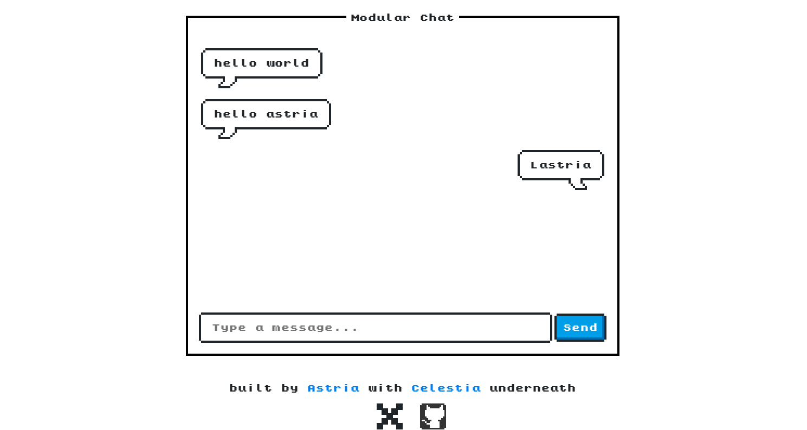

# Deploy a `noVM` Messenger Rollup using the Astria Deployment Charts

The primary difference between this tutorial and the [Run a noVM-messenger
Rollup](./novm-messenger-rollup.md) tutorial is that we are shifting from a
rapid development workflow using the [astria-go
cli](../developer/astria-go/astria-go-installation.md) with minimal dependencies
and a subset of all software required for running in production, to
containerizing the software for a more realistic production simulation. While
the previous guide emphasized quick, iterative development with fewer
components, this version incorporates additional software dependencies to better
mimic a production environment while utilizing those tools to simplify the
deployment process with significantly fewer commands.

## Dependencies

Running the Deployment Charts requires the following dependencies:

- [docker](https://docs.docker.com/get-docker/)
- [kubectl](https://kubernetes.io/docs/tasks/tools/)
- [helm](https://helm.sh/docs/intro/install/)
- [kind](https://kind.sigs.k8s.io/docs/user/quick-start/#installation)
- [just](https://just.systems/man/en/chapter_4.html)

## Clone, Build, and Run the noVM Chat Rollup

Make sure that the Docker daemon is running, then run the following commands:

<!--@include: ../components/_clone-build-deploy-novm-messenger.md-->

Then open
[http://chat.astria-chat.127.0.0.1.nip.io/](http://chat.astria-chat.127.0.0.1.nip.io/) in
your browser to use the UI and send messages.



::: info
The deployment should take less than 5 minutes, but this will depend on the
speed of your machine and/or download times for images.
:::

## Cleanup

When you want to stop the local cluster you can run the following:

```bash
just delete-all
```
